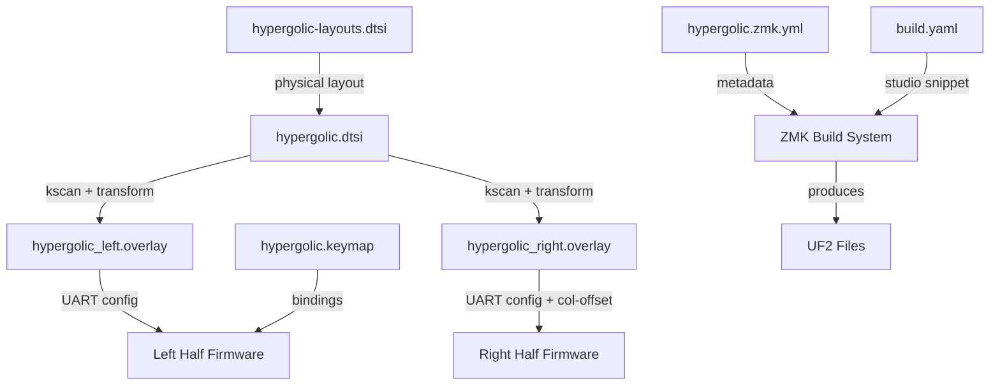

# Design Document: HyperGolic ZMK Studio Shield

## Overview

This design document describes the implementation of a new ZMK shield for the HyperGolic keyboard with ZMK Studio support. The shield will enable runtime keymap editing through ZMK Studio while maintaining wired UART communication between the split halves.

The HyperGolic is a 34-key split keyboard with a 3x5 layout plus 2 thumb keys per side. The implementation follows the patterns established by the existing `a_dux` shield which has working ZMK Studio support.

### Key Design Decisions

1. **New Shield Directory**: Create `boards/shields/hypergolic/` rather than modifying existing shields, ensuring clean separation and easy maintenance
2. **Physical Layout with Keys**: Include the `keys` property in the physical layout definition, which is mandatory for ZMK Studio support
3. **Wired Split**: Maintain UART-based wired communication, disabling Bluetooth entirely
4. **Reuse GPIO Mappings**: Use the same GPIO pin mappings from the existing `hypergarlic` shield since the hardware is identical

## Architecture

```
boards/shields/hypergolic/
├── hypergolic.dtsi           # Main shield definition (kscan, matrix transform)
├── hypergolic-layouts.dtsi   # Physical layout with keys property (ZMK Studio)
├── hypergolic.zmk.yml        # Shield metadata with studio feature flag
├── hypergolic_left.overlay   # Left half overlay (UART pins, includes dtsi)
├── hypergolic_left.conf      # Left half config (central, wired split)
├── hypergolic_right.overlay  # Right half overlay (UART pins, col-offset)
├── hypergolic_right.conf     # Right half config (peripheral, wired split)
├── Kconfig.defconfig         # Default Kconfig values
└── Kconfig.shield            # Shield definition for build system

config/
└── hypergolic.keymap         # Default keymap with studio_unlock combo
```

### Component Interaction



## Components and Interfaces

### 1. Physical Layout Definition (hypergolic-layouts.dtsi)

Defines the physical key positions for ZMK Studio visualization. Each key is specified with:
- Width and height (100 = 1u in centi-keyunit)
- X and Y position (top-left corner)
- Rotation (0 for standard keys)

The layout follows a 3x5 split with staggered columns:
- Left half: keys 0-16 (5 columns × 3 rows + 2 thumb)
- Right half: keys 17-33 (mirrored)

Key position coordinates (approximate, based on standard Cradio/Ferris layout):
```
Left Half:                    Right Half:
Col: 0    1    2    3    4    5    6    7    8    9
     Q    W    E    R    T    Y    U    I    O    P     Row 0
     A    S    D    F    G    H    J    K    L    ;     Row 1
     Z    X    C    V    B    N    M    ,    .    /     Row 2
                   TAB  RET  SPC  BSPC                  Thumbs
```

### 2. Main Shield Definition (hypergolic.dtsi)

Contains:
- **kscan0**: Direct GPIO scanning configuration with 17 input pins per half
- **default_transform**: Matrix transform mapping physical positions to logical positions
- **chosen node**: References physical_layout0 (not matrix_transform directly)

GPIO pin mappings (from existing hypergarlic shield):
```
Pin 0:  pro_micro_d 7   Pin 9:  pro_micro_d 1
Pin 1:  pro_micro_a 0   Pin 10: pro_micro_d 2
Pin 2:  pro_micro_a 1   Pin 11: pro_micro_d 3
Pin 3:  pro_micro_a 2   Pin 12: pro_micro_a 6
Pin 4:  pro_micro_a 3   Pin 13: pro_micro_d 5
Pin 5:  pro_micro_d 15  Pin 14: pro_micro_d 6
Pin 6:  pro_micro_d 14  Pin 15: pro_micro_d 8
Pin 7:  pro_micro_d 16  Pin 16: pro_micro_d 9
Pin 8:  pro_micro_d 10
```

### 3. Shield Metadata (hypergolic.zmk.yml)

```yaml
file_format: "1"
id: hypergolic
name: HyperGolic
type: shield
requires: [pro_micro]
features:
  - keys
  - studio
siblings:
  - hypergolic_left
  - hypergolic_right
```

### 4. Half-Specific Overlays

**Left (Central)**:
- Includes hypergolic.dtsi
- Configures UART with TX on pin 0,6 and RX on pin 0,8
- No column offset

**Right (Peripheral)**:
- Includes hypergolic.dtsi
- Configures UART with TX on pin 0,8 and RX on pin 0,6 (swapped)
- Sets col-offset = 17 on default_transform

### 5. Configuration Files (.conf)

Both halves:
- `CONFIG_ZMK_SPLIT=y`
- `CONFIG_ZMK_SPLIT_BLE=n`
- `CONFIG_BT=n`
- `CONFIG_ZMK_BLE=n`

Left only:
- `CONFIG_ZMK_SPLIT_ROLE_CENTRAL=y`

Right only:
- `CONFIG_ZMK_SPLIT_ROLE_CENTRAL=n`

### 6. Keymap (hypergolic.keymap)

Based on existing cradio.keymap with:
- `studio_unlock` combo on keys 0+1 (Q+W)
- `display-name` property on each layer
- Same layer structure: Base, Numbers, Symbols, Function

## Data Models

### Physical Key Attributes

Each key in the physical layout uses the `key_physical_attrs` structure:
```
<&key_physical_attrs width height x y rotation rot_x rot_y>
```

| Field | Type | Unit | Description |
|-------|------|------|-------------|
| width | int | centi-keyunit | Key width (100 = 1u) |
| height | int | centi-keyunit | Key height (100 = 1u) |
| x | uint | centi-keyunit | X position of top-left |
| y | uint | centi-keyunit | Y position of top-left |
| rotation | int | centi-degree | Clockwise rotation |
| rot_x | int | centi-keyunit | Rotation origin X |
| rot_y | int | centi-keyunit | Rotation origin Y |

### Matrix Transform

34 keys mapped as single-row matrix:
- Left half: RC(0,0) through RC(0,16)
- Right half: RC(0,17) through RC(0,33)


## Correctness Properties

*A property is a characteristic or behavior that should hold true across all valid executions of a system-essentially, a formal statement about what the system should do. Properties serve as the bridge between human-readable specifications and machine-verifiable correctness guarantees.*

Given the nature of this feature (creating ZMK shield configuration files), most acceptance criteria are structural validations best verified through example-based tests rather than property-based tests. The implementation creates specific files with specific content rather than functions that transform arbitrary inputs.

### Testable Examples

The following acceptance criteria will be verified through example-based validation during implementation:

| Criteria | Validation Method |
|----------|-------------------|
| 1.1 Physical layout has 34 keys | Count key entries in hypergolic-layouts.dtsi |
| 1.2 zmk.yml has studio feature | Check features list contains "studio" |
| 1.3 Chosen node references physical layout | Verify zmk,physical-layout in chosen node |
| 2.1-2.2 UART pin configuration | Verify pinctrl settings in overlays |
| 2.3 Bluetooth disabled | Check CONFIG_BT=n in .conf files |
| 2.4 Central role assignment | Verify SPLIT_ROLE_CENTRAL in .conf files |
| 3.1 GPIO pin mappings | Compare input-gpios with hypergarlic shield |
| 3.2 Matrix transform structure | Verify 34 RC entries and col-offset=17 |
| 4.1-4.2 build.yaml entries | Check shield entries with correct flags |
| 5.1 studio_unlock binding | Verify combo exists in keymap |
| 5.2 Layer display names | Check display-name on each layer |

### Non-Testable Criteria

- 1.4 (Accurate coordinates): Visual verification required
- 4.3 (Build produces UF2): CI/CD integration test
- 5.3 (Keymap compatibility): Design review concern

## Error Handling

### Build Errors

| Error | Cause | Resolution |
|-------|-------|------------|
| Missing physical_layouts.dtsi include | Forgot to include header | Add `#include <physical_layouts.dtsi>` |
| Undefined kscan0 | Physical layout references missing kscan | Ensure kscan0 is defined in hypergolic.dtsi |
| UART not working | Wrong pin configuration | Verify TX/RX pins match hardware |
| Studio not available | Missing snippet or cmake arg | Add studio-rpc-usb-uart snippet and -DCONFIG_ZMK_STUDIO=y |
| Keys not registering | Wrong GPIO pins | Compare with working hypergarlic shield |

### Runtime Errors

| Error | Cause | Resolution |
|-------|-------|------------|
| ZMK Studio can't connect | USB CDC-ACM not enabled | Ensure studio-rpc-usb-uart snippet is included |
| Keyboard locked | studio_unlock not triggered | Press combo keys (Q+W) to unlock |
| Split halves not communicating | UART misconfiguration | Verify TX/RX are swapped between halves |

## Testing Strategy

### Validation Approach

Since this feature creates configuration files rather than executable code, testing focuses on:

1. **Structural Validation**: Verify files contain required elements
2. **Build Verification**: Confirm firmware compiles without errors
3. **Functional Testing**: Manual testing of built firmware

### Pre-Build Validation Checklist

Before building, verify:
- [ ] hypergolic-layouts.dtsi has exactly 34 key entries
- [ ] hypergolic.zmk.yml includes "studio" in features
- [ ] hypergolic.dtsi references physical_layout0 in chosen node
- [ ] GPIO pins match hypergarlic shield
- [ ] Left overlay has TX=0,6 RX=0,8
- [ ] Right overlay has TX=0,8 RX=0,6 (swapped)
- [ ] Both .conf files have CONFIG_BT=n
- [ ] Left .conf has SPLIT_ROLE_CENTRAL=y
- [ ] Right .conf has SPLIT_ROLE_CENTRAL=n
- [ ] build.yaml has both shield entries
- [ ] Left entry has studio snippet and cmake arg
- [ ] Keymap has studio_unlock combo
- [ ] All layers have display-name

### Build Verification

1. Run GitHub Actions workflow
2. Verify both UF2 files are produced
3. Check build logs for warnings

### Functional Testing

1. Flash left half with hypergolic_left firmware
2. Flash right half with hypergolic_right firmware
3. Verify all 34 keys register correctly
4. Connect to ZMK Studio via USB
5. Trigger studio_unlock combo (Q+W)
6. Verify keymap editing works
7. Make a change and verify it persists
