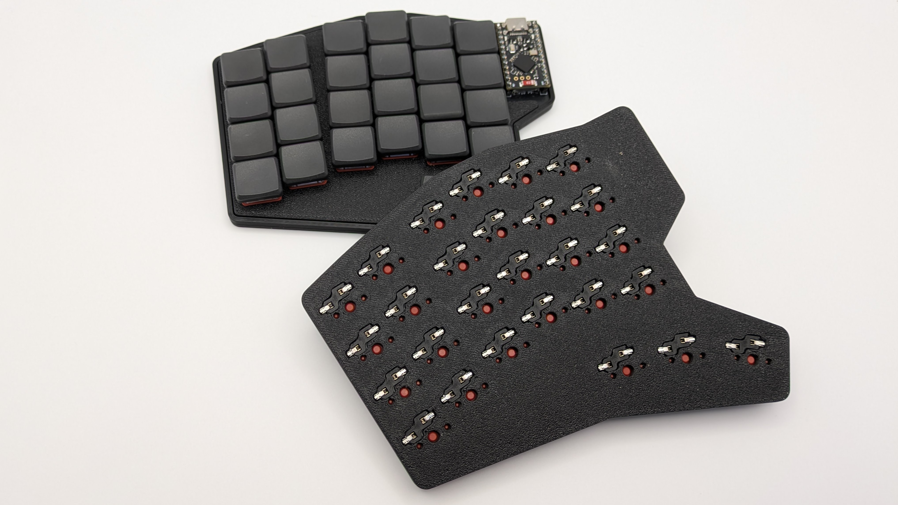
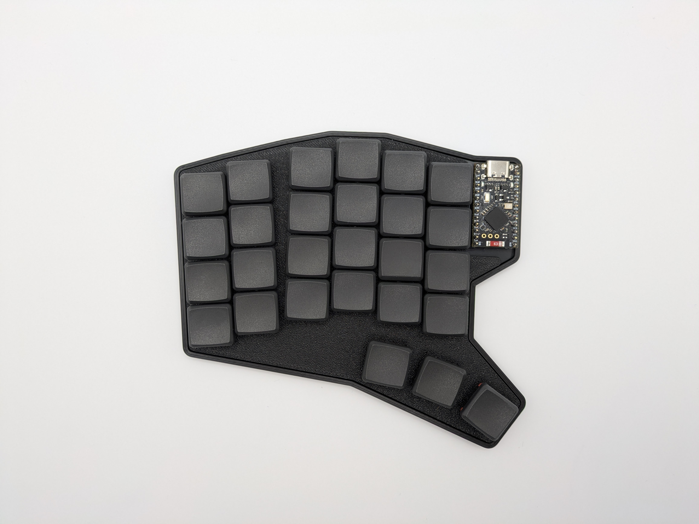
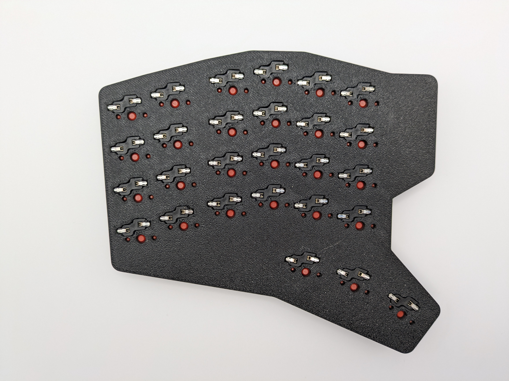
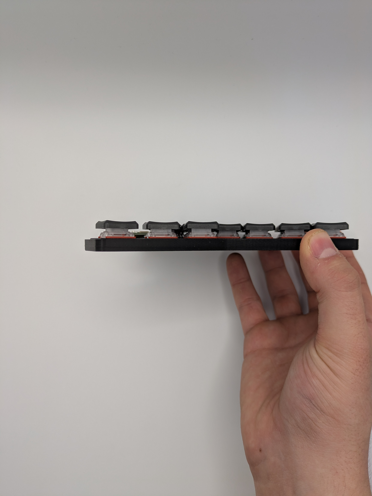

# Bug54 keyboard
The Bug54 is a 54 key split keyboard featuring a 4x6 column staggered layout with 3 thumb keys.

I'm up to building this keyboard for people who don't want to do so themselves. Feel free to reach out to me.

## Features:
- 54 key column staggered layout
- Hotswap Kailh Choc V1 & V2
- Ultra thin: **5.7mm** for the case and **< 15mm** to the top of the keys for great portability
- Reversible PCBs for greater efficiency when ordering
- ZMK Studio Support

## Hardware
The Bug54 is designed for NiceNano V2 and compatible microcontrollers.

## Quirks / Issues / Ideas
- Currently there is only support for SOD323 Diodes
- My custom footprint for the hotswap case cutouts is non ideal and depending on your 3D Printer settings, the fit might be too tight / loose. For me they snap in with a bit of pressure, thus there is no need for screws
- It might be smart to upstream the ZMK config to the ZMK repository

## Images

